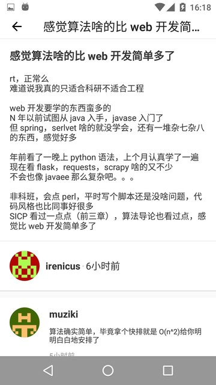

V2EX MVVM Best Practice
=======================

V2EX unofficial android client, use the ```RxAndroid``` and ```retrofit``` and ```DataBinding``` to realize MVVM frame. This is the best practice of RxJava MVVM, i hope it will help.

# Preview




