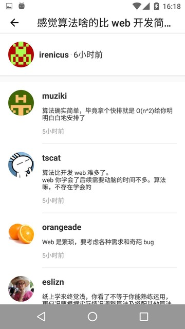

V2EX MVVM Best Practice
=======================

V2EX unofficial android client, use the ```RxAndroid``` and ```retrofit``` and ```DataBinding``` to realize MVVM frame. This is the best practice of RxJava MVVM, i hope it will help.

# Preview

## Apk Download

You can download and install into your phone to experience the app here. [!apk download](./apks/v2ex-demo-1.0.apk)

## Home Preview


## Topic Preview


## Topic Reply Preview

